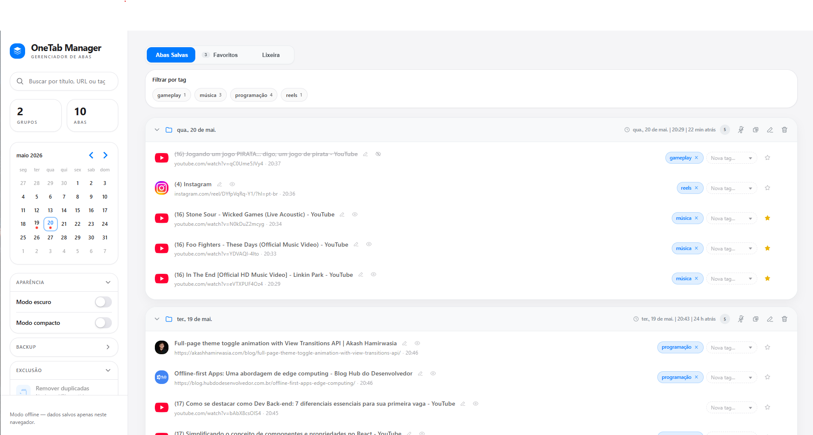
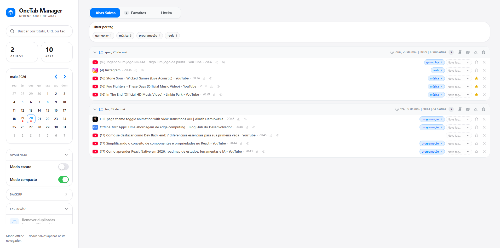
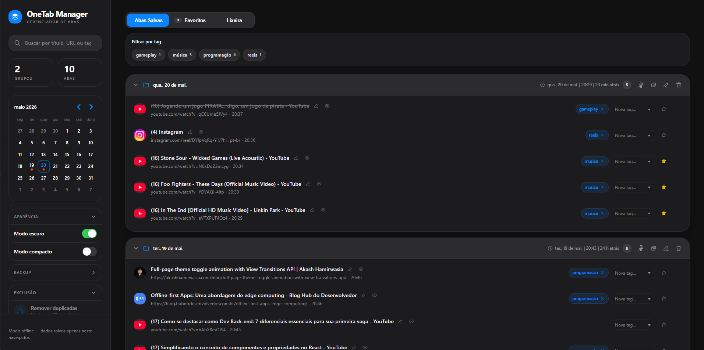
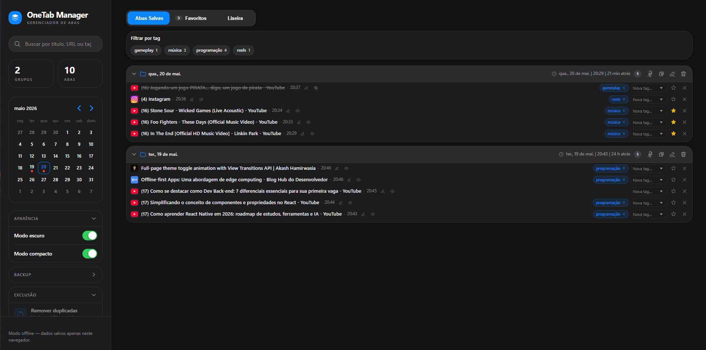

# One Tab Manager

Extensão para **Google Chrome** (Manifest V3) inspirada no conceito do OneTab: ao salvar uma aba, ela é **fechada no navegador** e guardada em uma lista local para você reabrir quando quiser, sem deixar dezenas de guias abertas.

Os dados ficam **apenas no seu navegador** (`chrome.storage.local`). Não há conta, servidor nem sincronização em nuvem.

## Interface

| Tema claro — layout padrão | Tema claro — modo compacto |
| :---: | :---: |
|  |  |

| Tema escuro — layout padrão | Tema escuro — modo compacto |
| :---: | :---: |
|  |  |

## Funcionalidades

### Salvar abas

- **Clique no ícone da extensão** — salva a aba em foco e a fecha.
- **Menu de contexto** (botão direito no ícone ou na página):
  - Abrir a lista de abas salvas
  - Enviar todas as guias da janela atual
  - Enviar todas as guias do grupo de guias do Chrome
  - Enviar as guias selecionadas (destacadas)
  - Enviar somente esta guia
  - Enviar todas as guias, exceto esta
  - Enviar as guias à esquerda ou à direita da guia atual
  - Enviar todas as guias de todas as janelas
  - **Salvar link** em links da página (menu de contexto em hiperlinks)
  - **Excluir / incluir site** — impede que URLs de um hostname sejam salvas acidentalmente
- **Integração LivePix** — em `dashboard.livepix.gg`, botão para salvar links de mensagens de doação e marcação visual de links já salvos ou já abertos.

Ao salvar, abas com URLs restritas (`chrome://`, `about:`, etc.) são ignoradas. Se a URL já existir na lista, um **prompt na página** pergunta se você quer manter a versão nova ou a antiga.

### Organização na lista

- Grupos **agrupados por dia** do calendário (com título editável e opção de **fixar** grupo no topo).
- Três seções: **Salvas**, **Favoritos** e **Lixeira**.
- Por aba: editar título, marcar como **visualizada**, adicionar **tags**, favoritar e mover para a lixeira.
- Por grupo: expandir/recolher, abrir **abas não vistas**, renomear e excluir o grupo inteiro.
- Ao reabrir uma aba que já está aberta no Chrome, opção de **ir para a guia existente** em vez de duplicar.

### Busca e filtros

- Busca por **título, URL ou tag**.
- Filtro por **tags** (uma ou várias; exibe abas com qualquer tag selecionada).
- Filtro por **intervalo de datas** no calendário lateral.
- Contadores de grupos e abas na barra lateral.

### Lixeira

- Itens excluídos vão para a lixeira (agrupados por dia).
- **Restaurar** entradas ou **apagar permanentemente**.
- Ação para **esvaziar a lixeira**.

### Manutenção e backup

- **Exportar** e **importar** grupos em JSON (substituir tudo ou adicionar apenas o que falta, com prévia de duplicatas).
- **Remover duplicadas** — mesma URL em mais de uma aba (escolha manter a mais recente ou a mais antiga).
- **Limpar vistas antigas** — remove abas já marcadas como visualizadas há mais de 2 meses (favoritos preservados).
- **Mover tudo para a lixeira** em uma única ação.

### Aparência

- **Modo escuro** e **modo compacto** na página de opções.
- Layout responsivo com menu lateral em telas menores.

## Desenvolvimento

Requisitos: Node.js e npm.

```bash
npm install
npm run dev    # desenvolvimento com Vite + CRXJS
npm run build  # build de produção (pasta dist/)
npm run lint
```

Para instalar no Chrome: execute `npm run build`, abra `chrome://extensions`, ative o **Modo do desenvolvedor** e carregue a pasta `dist` descompactada.

## Stack

- React 19 + TypeScript
- Vite 8 + [@crxjs/vite-plugin](https://crxjs.dev/vite-plugin)
- APIs `chrome.*` (tabs, storage, contextMenus, scripting)

## Privacidade

Consulte [docs/privacidade.html](docs/privacidade.html) para detalhes sobre permissões e armazenamento local.
